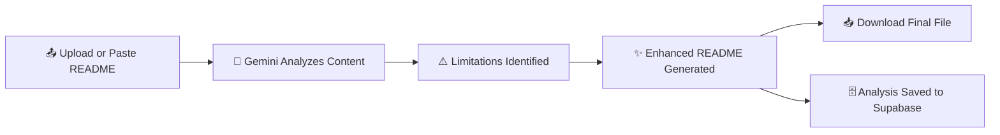

<div align="center">


[](https://nextjs.org/)
[](https://www.typescriptlang.org/)
[](https://tailwindcss.com/)
[](https://supabase.com/)
[](https://ai.google.dev/)
[](https://www.langchain.com/)
[](https://vercel.com/)
[](LICENSE)


### ✨ Stop writing bad READMEs by hand. Let AI find what's missing and fix it for you.

</div>

<br/>

## 📋 Table of Contents

| # | Section |
|:--|:--------|
| 01 | [📖 About](#-about) |
| 02 | [🎯 Key Features](#-key-features) |
| 03 | [🛠️ Tech Stack](#️-tech-stack) |
| 04 | [🖼️ Demo and Screenshots](#️-demo-and-screenshots) |
| 05 | [🚀 Getting Started](#-getting-started) |
| 06 | [📘 Usage Guide](#-usage-guide) |
| 07 | [🔑 Environment Variables](#-environment-variables) |
| 08 | [🗄️ Database Setup](#️-database-setup) |
| 09 | [☁️ Deployment](#️-deployment) |
| 10 | [🤝 Contributing](#-contributing) |
| 11 | [📄 License](#-license) |
| 12 | [🙏 Acknowledgments](#-acknowledgments) |

---

## 📖 About

**README AI Enhancer** is a web application that takes a tired, incomplete, or messy `README.md` file and turns it into something that actually helps people understand your project.

Upload a file or paste raw markdown, and the app uses **Google Gemini AI**, orchestrated through **LangChain**, to analyze the content for gaps such as missing setup instructions, unclear feature descriptions, absent badges, or weak structure. It then generates a rewritten, professional version that you can review and download instantly.

Every analysis is securely stored in **Supabase**, so nothing about the process is a black box, and the entire experience runs on a fast, serverless **Next.js** stack deployed on **Vercel**.

<div align="center">

</div>

---

## 🎯 Key Features

<div align="center">

| Feature | Icon | Description |
|---|:---:|---|
| **Flexible Input** | 📤 | Upload a `.md` file directly or paste raw markdown text |
| **AI Powered Analysis** | 🧠 | Google Gemini scans your README for gaps, weak spots, and missing sections |
| **Smart Enhancement** | ✨ | Generates a rewritten, structured, and professional README |
| **One Click Download** | 📥 | Download the enhanced README.md file instantly |
| **Secure Storage** | 🔒 | Every analysis is saved securely in a Supabase database |
| **Serverless Backend** | ⚡ | Runs entirely on Next.js API routes, no server to manage |

</div>

✅ No manual formatting guesswork
🎯 Consistent, professional structure every time
📦 Works with any existing README, however messy

---

## 🛠️ Tech Stack

<div align="center">

| Layer | Technology |
|---|---|
| 🎨 **Frontend** | Next.js, TypeScript, Tailwind CSS |
| ⚙️ **Backend** | Next.js API routes (serverless) |
| 🗄️ **Database** | Supabase (PostgreSQL) |
| 🧠 **AI** | Google Gemini via LangChain |
| 📤 **File Upload** | Formidable |
| ☁️ **Deployment** | Vercel |

<br/>


&nbsp;

&nbsp;

&nbsp;

&nbsp;


</div>

---

## 🖼️ Demo and Screenshots

<div align="center">

> 📸 Screenshots of the upload screen, AI analysis view, and enhanced README preview go here.

| Upload Screen | AI Analysis | Enhanced Output |
|:---:|:---:|:---:|
| 🖼️ *screenshot placeholder* | 🖼️ *screenshot placeholder* | 🖼️ *screenshot placeholder* |

🎬 A live demo link can be added here once the project is deployed.

</div>

---

## 🚀 Getting Started

### ✅ Prerequisites

Make sure you have the following before you begin:

- 🟢 **Node.js** v18 or later
- 📦 **npm** v9 or later
- 🗄️ A **Supabase** account and project
- 🔑 A **Google Gemini API key**

<details open>
<summary><b>1️⃣ Clone the repository</b></summary>
<br/>

```bash
git clone https://github.com/AbdulAzeemHashmi/readme-ai-enhancer.git
cd readme-ai-enhancer
```

</details>

<details open>
<summary><b>2️⃣ Install dependencies</b></summary>
<br/>

```bash
npm install
```

</details>

<details open>
<summary><b>3️⃣ Configure environment variables</b></summary>
<br/>

Create a `.env.local` file in the project root and add your keys (see the [Environment Variables](#-environment-variables) section below for the full list).

```bash
cp .env.example .env.local
```

</details>

<details open>
<summary><b>4️⃣ Run the development server</b></summary>
<br/>

```bash
npm run dev
```

Open [http://localhost:3000](http://localhost:3000) in your browser. 🎉

</details>

---

## 📘 Usage Guide

<div align="center">



</div>

1. 📤 **Provide your README**: upload a `.md` file or paste raw markdown text into the input box
2. 🧠 **Let AI analyze it**: Gemini scans the content for structural gaps, missing sections, and unclear writing
3. ⚠️ **Review the findings**: see a summary of what's missing or weak in your current README
4. ✨ **Generate the enhanced version**: the app produces a polished, well structured rewrite
5. 📥 **Download and use it**: save the new `README.md` and drop it straight into your repository

---

## 🔑 Environment Variables

Create a `.env.local` file with the following variables:

<div align="center">

| Variable | Description | Required |
|---|---|:---:|
| `GOOGLE_GEMINI_API_KEY` | Your Google Gemini API key for AI analysis and generation | ✅ |
| `NEXT_PUBLIC_SUPABASE_URL` | Your Supabase project URL | ✅ |
| `NEXT_PUBLIC_SUPABASE_ANON_KEY` | Your Supabase public anon key | ✅ |
| `SUPABASE_SERVICE_ROLE_KEY` | Your Supabase service role key, used server side only | ✅ |
| `NEXT_PUBLIC_APP_URL` | The base URL of your deployed app | ⚙️ Optional |

</div>

```env
GOOGLE_GEMINI_API_KEY=your_gemini_api_key_here
NEXT_PUBLIC_SUPABASE_URL=your_supabase_project_url
NEXT_PUBLIC_SUPABASE_ANON_KEY=your_supabase_anon_key
SUPABASE_SERVICE_ROLE_KEY=your_supabase_service_role_key
NEXT_PUBLIC_APP_URL=http://localhost:3000
```

> ⚠️ **Never commit your `.env.local` file.** It is already excluded via `.gitignore`.

---

## 🗄️ Database Setup

README AI Enhancer uses a single Supabase table to store analysis results.

<details open>
<summary><b>📋 SQL schema for the `readme_analyses` table</b></summary>
<br/>

```sql
create table readme_analyses (
  id uuid primary key default gen_random_uuid(),
  original_content text not null,
  enhanced_content text,
  limitations jsonb,
  created_at timestamp with time zone default now(),
  updated_at timestamp with time zone default now()
);

-- Enable row level security
alter table readme_analyses enable row level security;

-- Allow inserts and reads for authenticated and anon requests as needed
create policy "Allow insert" on readme_analyses
  for insert with check (true);

create policy "Allow select" on readme_analyses
  for select using (true);
```

</details>

<div align="center">

| Column | Type | Description |
|---|---|---|
| `id` | uuid | Primary key, auto generated |
| `original_content` | text | The README content submitted by the user |
| `enhanced_content` | text | The AI generated enhanced README |
| `limitations` | jsonb | Structured list of issues found by the AI |
| `created_at` | timestamptz | Record creation timestamp |
| `updated_at` | timestamptz | Record update timestamp |

</div>

---

## ☁️ Deployment

README AI Enhancer is built to deploy seamlessly on **Vercel**.

<details open>
<summary><b>🚀 Deploy your own instance</b></summary>
<br/>

1. 📤 Push your fork to GitHub
2. 📥 Import the repository into [Vercel](https://vercel.com/new)
3. 🔑 Add all required environment variables in the Vercel project settings
4. ⚙️ Vercel automatically detects the Next.js framework and configures the build
5. 🚀 Click **Deploy**

</details>

```bash
# Or deploy directly from the CLI
npm install -g vercel
vercel
```

---

## 🤝 Contributing

Contributions, issues, and feature requests are welcome.

1. 🍴 Fork the repository
2. 🌿 Create a feature branch: `git checkout -b feature/your-feature-name`
3. 💻 Make your changes and commit: `git commit -m "Add your feature"`
4. 🔀 Push to your branch: `git push origin feature/your-feature-name`
5. 📬 Open a Pull Request

Please open an issue first for major changes so we can discuss what you would like to build.

---

## 📄 License

This project is licensed under the **MIT License**. See the [LICENSE](./LICENSE) file for details.

---

## 🙏 Acknowledgments

- 🧠 **Google Gemini** for powering the AI analysis and generation
- 🔗 **LangChain** for orchestrating the AI workflow
- 🗄️ **Supabase** for a fast and reliable backend database
- ▲ **Vercel** for effortless deployment and hosting
- 💛 Everyone who has ever suffered through writing a README by hand

---

<div align="center">

### ⭐ If README AI Enhancer saved you time, consider giving it a star

<a href="https://github.com/AbdulAzeemHashmi/readme-ai-enhancer/stargazers">

</a>

<br/><br/>

Made with 💜 by [Abdul Azeem Hashmi](https://github.com/AbdulAzeemHashmi)


</div>