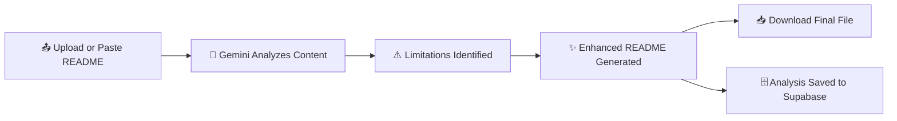

<div align="center">


<br/>


<br/><br/>

[](https://nextjs.org/)
[](https://www.typescriptlang.org/)
[](https://tailwindcss.com/)
[](https://fastapi.tiangolo.com/)
[](https://supabase.com/)
[](https://ai.google.dev/)
[](https://vercel.com/)
[](LICENSE)

<br/>


&nbsp;

&nbsp;


<br/><br/>

> ✨ **Stop writing weak READMEs by hand. Let AI find every flaw and fix it for you.**

<br/>

<a href="https://readme-ai-enhancer.vercel.app/" target="_blank">
  
</a>
&nbsp;
<a href="https://github.com/AbdulAzeemHashmi/readme-ai-enhancer" target="_blank">
  
</a>

</div>

<br/>

## 📋 Table of Contents

| # | Section |
|:--|:--------|
| 01 | [📖 About](#-about) |
| 02 | [🎯 Key Features](#-key-features) |
| 03 | [🛠️ Tech Stack](#️-tech-stack) |
| 04 | [📂 Project Structure](#-project-structure) |
| 05 | [🚀 Getting Started](#-getting-started) |
| 06 | [📘 How It Works](#-how-it-works) |
| 07 | [🔑 Environment Variables](#-environment-variables) |
| 08 | [🗄️ Database Setup](#️-database-setup) |
| 09 | [☁️ Deployment](#️-deployment) |
| 10 | [🤝 Contributing](#-contributing) |
| 11 | [📄 License](#-license) |
| 12 | [🙏 Acknowledgments](#-acknowledgments) |

---

## 📖 About

**README AI Enhancer** is a web application that takes any tired, incomplete, or messy `README.md` and turns it into something that actually makes people want to use your project.

Upload a `.md` or `.txt` file, or paste raw Markdown text directly. Your content is sent to a **Python FastAPI backend**, deployed as serverless functions on Vercel, which calls **Google Gemini** to scan for gaps like missing setup instructions, unclear feature descriptions, absent badges, or weak structure. Gemini then generates a fully rewritten, professional version that you can review and download in one click.

Every analysis is stored in **Supabase** so results are always retrievable later. The frontend runs on **Next.js 14** with **TypeScript** and **Tailwind CSS**, and the whole stack is deployed serverlessly on **Vercel**.

🔠 Accepts up to **8,000 characters** of input
⚡ Typical results generated in **5 to 15 seconds**

<div align="center">

</div>

---

## 🎯 Key Features

<div align="center">

| Feature | Icon | Description |
|:--------|:----:|:------------|
| **Flexible Input** | 📤 | Upload a `.md` or `.txt` file, or paste raw Markdown text directly |
| **AI Powered Analysis** | 🧠 | Google Gemini scans for gaps, weak spots, and missing sections |
| **Smart Enhancement** | ✨ | Generates a fully rewritten, structured, professional README |
| **One Click Download** | 📥 | Download the enhanced `README.md` file instantly |
| **Drag and Drop Upload** | 🖱️ | Drop your file anywhere on the upload zone |
| **Secure Storage** | 🔒 | Every analysis is saved to Supabase for later retrieval |
| **Serverless Backend** | ⚡ | Python FastAPI running as Vercel serverless functions |
| **Vercel Ready** | ▲ | Zero config deployment to Vercel with environment variables |

</div>

✅ No manual formatting guesswork
🎯 Consistent, professional structure every time
📦 Works with any existing README, however messy
🚀 Results in 5 to 15 seconds

---

## 🛠️ Tech Stack

<div align="center">

| Layer | Technology | Purpose |
|:------|:-----------|:--------|
| 🎨 **Frontend** | Next.js 14 (Pages Router) + TypeScript | UI and client side routing |
| 💅 **Styling** | Tailwind CSS | Dark, modern glassmorphism design |
| ⚙️ **Backend** | Python FastAPI | Serverless API endpoints on Vercel |
| 🗄️ **Database** | Supabase (PostgreSQL) | Analysis result storage |
| 🧠 **AI Model** | Google Gemini | Limitation detection and README rewriting |
| ☁️ **Deployment** | Vercel | Hosting, serverless functions, and CI/CD |

<br/>


&nbsp;

&nbsp;

&nbsp;

&nbsp;


</div>

---

## 📂 Project Structure

```
readme-ai-enhancer/
├── 🐍 api/                       # Python FastAPI backend (Vercel serverless functions)
│   ├── __init__.py
│   ├── gemini_client.py         # Google Gemini API integration
│   ├── index.py                 # FastAPI entry point and routes
│   └── supabase_client.py       # Supabase client and queries
│
├── ⚛️ pages/                     # Next.js Pages Router
│   ├── result/
│   │   └── [id].tsx             # Dynamic result page for a given analysis
│   ├── _app.tsx                 # App wrapper
│   └── index.tsx                # Upload and home page
│
├── 🎨 styles/
│   └── globals.css              # Tailwind imports and global styles
│
├── 🔒 .env                       # Environment variable template
├── 🔒 .env.local                 # Your local secrets (never committed)
├── 🚫 .gitignore
├── 📦 .npmrc
├── 🔷 next-env.d.ts
├── ⚙️ next.config.js
├── 📦 package.json
├── 📦 package-lock.json
├── 🔧 postcss.config.js
├── 📘 README.md
├── 🐍 requirements.txt           # Python dependencies for the FastAPI backend
├── 🌊 tailwind.config.js
├── 📘 tsconfig.json
└── 🔺 vercel.json                # Vercel routing and function configuration
```

---

## 🚀 Getting Started

### ✅ Prerequisites

Before you begin, make sure you have:

- 🟢 **Node.js** v18 or later
- 📦 **npm** v9 or later
- 🐍 **Python** 3.10 or later (for local FastAPI development)
- 🗄️ A **Supabase** account and project ([supabase.com](https://supabase.com))
- 🔑 A **Google Gemini API key** ([aistudio.google.com](https://aistudio.google.com))

<details open>
<summary><b>1️⃣ Clone the repository</b></summary>
<br/>

```bash
git clone https://github.com/AbdulAzeemHashmi/readme-ai-enhancer.git
cd readme-ai-enhancer
```

</details>

<details open>
<summary><b>2️⃣ Install dependencies</b></summary>
<br/>

Install the Node dependencies for the Next.js frontend:

```bash
npm install
```

Install the Python dependencies for the FastAPI backend:

```bash
pip install -r requirements.txt
```

</details>

<details open>
<summary><b>3️⃣ Configure environment variables</b></summary>
<br/>

Create a `.env.local` file in the project root:

```bash
cp .env .env.local
```

Then fill in your real values, see the [Environment Variables](#-environment-variables) section below.

</details>

<details open>
<summary><b>4️⃣ Run the development server</b></summary>
<br/>

```bash
npm run dev
```

Open [http://localhost:3000](http://localhost:3000) in your browser. 🎉

</details>

---

## 📘 How It Works

<div align="center">



</div>

<div align="center">

| Step | Action | Description |
|:----:|:-------|:------------|
| 1 | 📤 **Provide your README** | Upload a `.md` or `.txt` file, or paste raw Markdown text into the editor |
| 2 | 🧠 **AI analyzes it** | The FastAPI backend calls Gemini to scan for structural gaps, missing sections, and unclear writing |
| 3 | ⚠️ **Review the findings** | See a clear list of what is weak or missing in your current README |
| 4 | ✨ **Get the enhanced version** | The app produces a polished, well structured, emoji rich rewrite |
| 5 | 📥 **Download and use it** | Save the new `README.md` and drop it directly into your repository |

</div>

---

## 🔑 Environment Variables

Create a `.env.local` file in the project root with these values:

<div align="center">

| Variable | Description | Required |
|:---------|:------------|:--------:|
| `GEMINI_API_KEY` | Your Google AI Studio API key | ✅ |
| `NEXT_PUBLIC_SUPABASE_URL` | Your Supabase project URL | ✅ |
| `NEXT_PUBLIC_SUPABASE_ANON_KEY` | Your Supabase public anon key | ✅ |

</div>

```env
GEMINI_API_KEY=your_google_ai_studio_api_key
NEXT_PUBLIC_SUPABASE_URL=https://your-project.supabase.co
NEXT_PUBLIC_SUPABASE_ANON_KEY=your_supabase_anon_key
```

> ⚠️ **Never commit your `.env.local` file.** It is already listed in `.gitignore`.

---

## 🗄️ Database Setup

README AI Enhancer stores every analysis result in a single Supabase table.

<details open>
<summary><b>📋 Run this SQL in your Supabase SQL editor</b></summary>
<br/>

```sql
create table readme_analyses (
  id            uuid primary key default gen_random_uuid(),
  original_text text not null,
  limitations   text,
  improved_text text,
  status        text default 'processing',
  created_at    timestamptz default now()
);

-- Enable Row Level Security
alter table readme_analyses enable row level security;

-- Allow anon inserts and reads (adjust as needed for your use case)
create policy "Allow insert" on readme_analyses
  for insert with check (true);

create policy "Allow select" on readme_analyses
  for select using (true);

create policy "Allow update" on readme_analyses
  for update using (true);
```

</details>

<div align="center">

| Column | Type | Description |
|:-------|:-----|:------------|
| `id` | uuid | Primary key, auto generated |
| `original_text` | text | The README content submitted by the user |
| `limitations` | text | List of issues found by Gemini |
| `improved_text` | text | The AI generated enhanced README |
| `status` | text | Either `processing` or `completed` |
| `created_at` | timestamptz | Record creation timestamp |

</div>

---

## ☁️ Deployment

README AI Enhancer is built to deploy on **Vercel** with minimal configuration, running the Next.js frontend alongside the Python FastAPI backend as serverless functions.

<details open>
<summary><b>🚀 Deploy to Vercel</b></summary>
<br/>

1. 📤 Push your fork to GitHub
2. 📥 Import the repository at [vercel.com/new](https://vercel.com/new)
3. 🔑 Add all three environment variables in the Vercel project settings
4. ⚙️ Vercel auto detects Next.js and the `api/` FastAPI functions and configures the build
5. 🚀 Click **Deploy**

</details>

```bash
# Or deploy directly from the CLI
npx vercel --prod
```

> 💡 **Tip:** Keep input under 8,000 characters to comfortably stay within serverless function timeout limits.

---

## 🤝 Contributing

Contributions, bug reports, and feature requests are welcome.

1. 🍴 Fork the repository
2. 🌿 Create a feature branch: `git checkout -b feature/your-feature`
3. 💻 Make your changes and commit: `git commit -m "feat: add your feature"`
4. 🔀 Push to your branch: `git push origin feature/your-feature`
5. 📬 Open a Pull Request

Please open an issue first for any major changes so we can discuss the approach together.

---

## 📄 License

This project is licensed under the **MIT License**. See the [LICENSE](./LICENSE) file for details.

---

## 🙏 Acknowledgments

- 🧠 **Google Gemini** for powering the AI analysis and generation
- ⚡ **FastAPI** for a fast, clean serverless Python backend
- 🗄️ **Supabase** for a reliable serverless database
- ▲ **Vercel** for effortless deployment and hosting
- ⚛️ **Next.js** for the frontend framework that ties it all together
- 💛 Everyone who has ever suffered through writing a README by hand

---

<div align="center">

### ⭐ If README AI Enhancer saved you time, please give it a star

<a href="https://github.com/AbdulAzeemHashmi/readme-ai-enhancer/stargazers">

</a>

<br/><br/>

Made with 💜 by [Abdul Azeem Hashmi](https://github.com/AbdulAzeemHashmi)


</div>